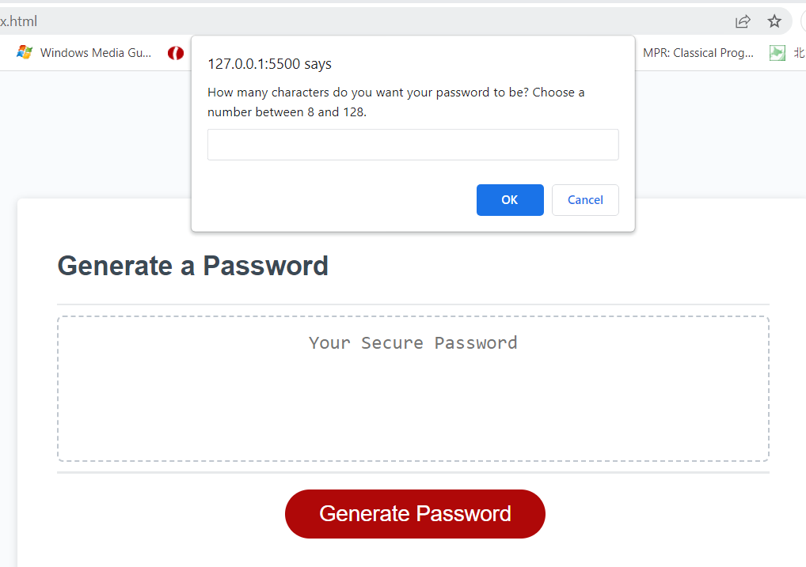

# Password Generator Starter Code

<strong>Title:</strong> Boot Camp Homework 3 - Password Generator

<strong>Description:</strong> The project was to add code to existing starter code to make a random password generator given input from the user.

<strong>Purpose:</strong> The purpose of the homework was to implement different kinds of JavaScript into one code to make a fully interactive password generator.

<strong>Notes:</strong> This is not completely finished. I missed part of one class due to illness and got behind and have not been able to catch back up fully. What you see in this file is a result of hours of rewatching class videos, 50 minutes with a tutor and using Office Hours to try to further the code and my understanding. You will see there is A LOT of psuedocode and notes. I hope to come back to this later to finish this code and make it fully operational as I gain more experience with coding.

See the page at this [link](https://carleemarie.github.io/Password-Generator/).

Screenshot of Deployed Page

